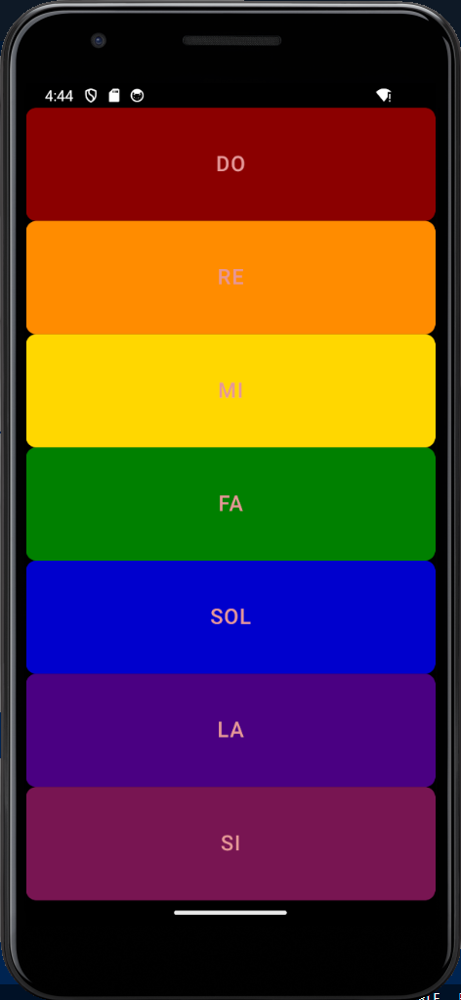

# Simple Flutter Xylophone App

This codebase defines a simple Flutter application that simulates a xylophone. The application utilizes the `audioplayers` package to play audio files, each corresponding to a different note of the xylophone. Below is a brief description of the key components of the code:

## Key Features

- **Xylophone Simulation:** Offers a virtual xylophone experience with touch-responsive keys.
- **Audio Playback:** Leverages the `audioplayers` package for playing distinct audio files for each xylophone note.
- **Custom UI:** Features a user-friendly interface with colorful buttons representing different musical notes.

## Screenshot



## Getting Started

To run this project, ensure you have Flutter installed on your machine. Clone the repository, navigate to the project directory, and execute:

```bash
flutter run
